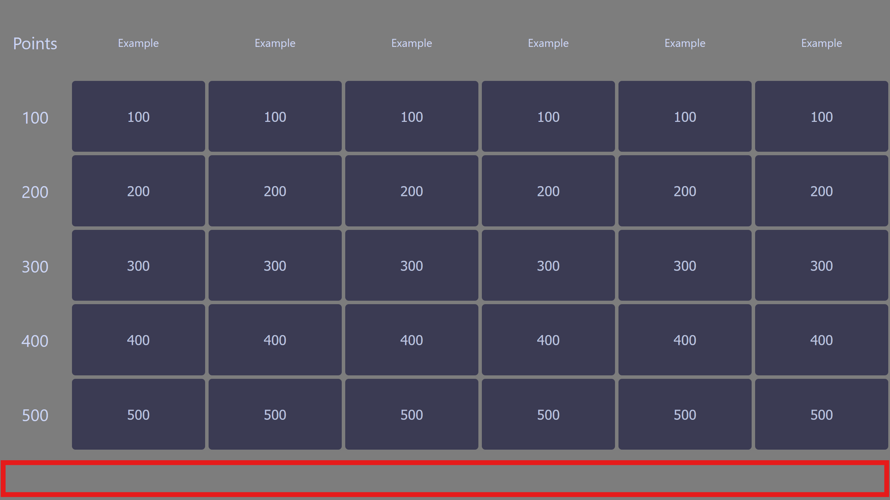
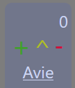

# Quiz Board

This is something I made so me and my friends can play a Jeopardy inspired quiz show.

## DISCLAIMER

This is a for fun project that isn't actively developed and an excuse to learn vue.
As a result this project currently has some quirks on how certain things work because I haven't had to change them yet.
Features were added when I needed them so the things you need might not be implemented.

## How to Use

This project uses [Vue3](https://vuejs.org/) with [Vite](https://vite.dev/), [Node.js](https://nodejs.org/en), and [pnpm](https://pnpm.io), please install these before continuing.

Clone the repository with git and install the dependencies
```shell
git clone https://github.com/Avie0108/quiz-board.git
cd quiz-board
pnpm install
```

### Adding Questions

To add question to the quiz you need to edit [questions.ts](src/questions.ts).
By default it should look like this:

```ts
import type { Category } from "./models/Category";

export const Questions: Category[] = [
    // here go your questions
];

export default Questions;
```

Every Question must be part of a Category:

```ts
export const Questions: Category[] = [
    {
        name: "Example Category",
        multiplier: 1.0, //optional multiplier of points
        icon: "Example.png", // optional icon for the category
        questions: { },
    }
];
```

A question must have a name, the points it's worth, the question itself, and the answer:

```ts
questions: {
    "example": { // the name
        points: 100, // points before multiplier is applied
        question: {
            text: "the question", // optional text
            image: { // optional image
                url: "questions/example.png", // url of the image minus public/
                height: 400, // optional height of the image
                width: 400, // optional width of the image
            },
            video: { // optional video
                url: "questions/example.mp4", // url of the video minus public/
                height: 400, // optional height of the video
                width: 400, // optional width of the video
            },
            audio: "example.mp3", // optional audio
        },
        answer: {
            text: "the question", // optional text
            image: "questions/example.png", // shortcut for image for when you don't care about size
            video: "questions/example.png", // shortcut for video for when you don't care about size
            audio: "example.mp3", // optional audio
        },
    }
}
```

Every Category is expected to have 5 questions sorted by point value, not doing this will make the questions not line up with the points on the board.
If you have a multiple categories with the same name make sure the question names are unique or else multiple questions might be marked as answered.

### Adding Background images

The background randomly cycles through images provided in the [backgrounds](public/backgrounds) directory. If you added or removed files to this directory use the following command to update [backgrounds.ts](src/data/backgrounds.ts):

```shell
pnpm build-bg
```

### Running the Application

use pnpm dev.

```shell
pnpm dev
```

### Adding Players

To add a player right click in the highlighted area:



You will be prompted for the users name and an optional background image to be displayed in the background of their score.
If the player wants to change their background image you can add a new player with the same name and different background this will update the background.

middle click on the player to remove them.

### Player Points

After having added a player they will have a score board like this:



Pressing the `+` button adds the points of the last selected question;
Pressing the `-` button removes those points.
The `^` button gives a bonus, half the points of the last selected question.

you can always edit the score of a player.

### Selecting a question

If you click on a question it will open the question.
Pressing `Space` will reveal the answer and mark the question as answered.
Pressing `Esc` will return to the board.

## Buzzers

To allow players to buzz in I would recommend https://buzzin.live.
